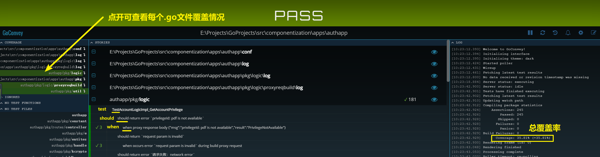
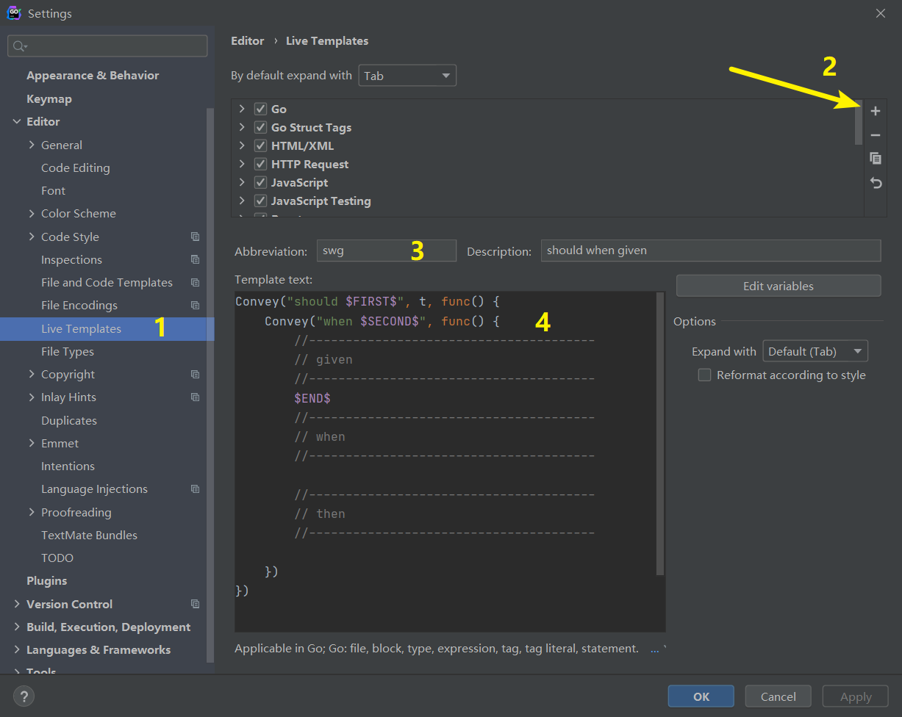

# GoConvey
```
go get github.com/smartystreets/goconvey
```

## 如何跑测试
cd到测试文件所在目录，执行：
```
go test -v 
```
或者执行以下命令，弹出web页面（默认：http://127.0.0.1:8080）：
```
goconvey
```
其中，`goconvey -help` 能出来相关的命令行选项说明，一般常用是这么写：
```
goconvey -port 8112 -excludedDirs "vendor,mock,proto"
```
表示：web页面在 http://127.0.0.1:8112，并且忽略当前上下文目录下的vendor目录、mock目录、proto目录。

图示：



## 格式规范
```go
func TestXxxService_XxxMethod(t *testing.T) {
	Convey("should return 情况A", t, func() {
		Convey("when 某逻辑 return `xxxx`", func() {
            // given
            ..........各种准备逻辑（mock、stub、声明、初始化、造数据等）
            // when
            res, err := xxxService.XxxMethod(....)
            // then
            So(res, ShouldEqual, "情况A")
        })
        Convey("when 传入了参数 keyA=`valA`, keyB=`valB`", func() {

        })
    })

    Convey("should return 情况B", t, func() {
		Convey("when ..................", func() {

        })
    })
}
```
如：
```
........
Convey("should return `解析响应体失败：response is empty`", t, func() {
		Convey("when proxy response with statusCode 200 and empty body is returned", func() {
........
```

## IDE 快速生成单元测试代码


以下的本人实践使用的模板：
```
Convey("should $FIRST$", t, func() {
    Convey("when $SECOND$", func() {
        //---------------------------------------
        // given
        //---------------------------------------
        $END$
        //---------------------------------------
        // when
        //---------------------------------------
        
        //---------------------------------------
        // then
        //---------------------------------------

    })
})
```

设置完毕后，写测试时，直接键入 `swg`然后点击 `tab`键，即可生成这段模板代码。

> 注意：测试代码当然需要引入convey库：`import . "github.com/smartystreets/goconvey/convey"`